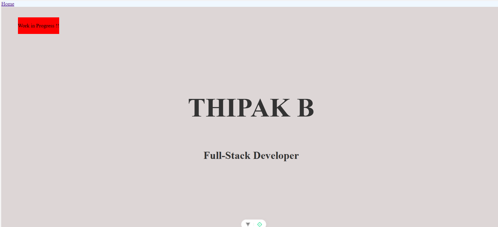

# Progress I made for my project

## 1. Basic Page
- Initializing the vue project.
- Created a basic page with a simple layout.
- Added some content to the page.
- created github workflow action to deploy the page to github pages.

## 2. Animation
- Added vue-kinesis library to the project.
- Added a simple animation to the page.

